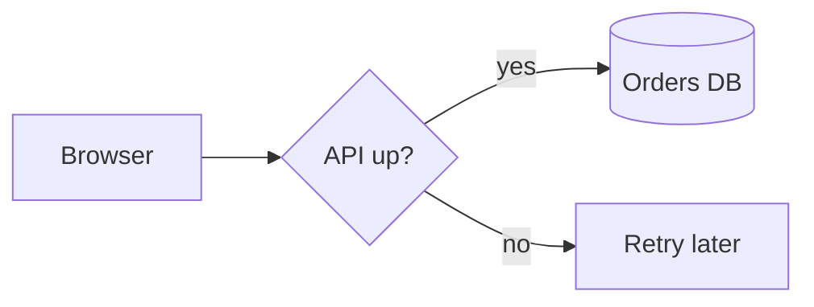
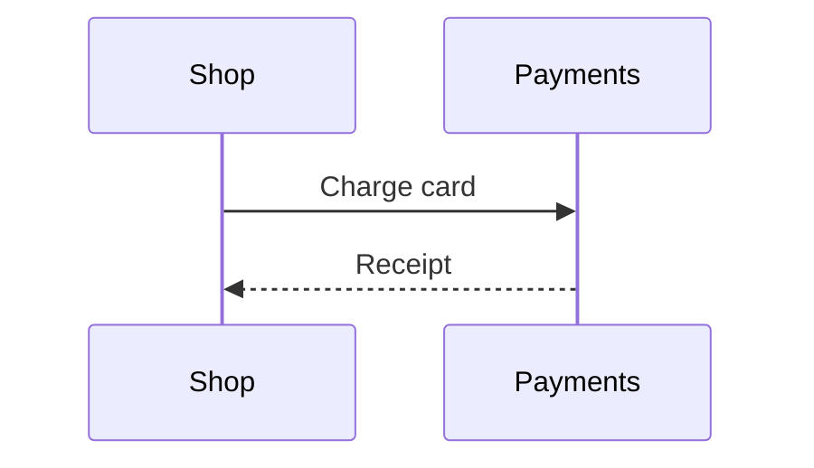
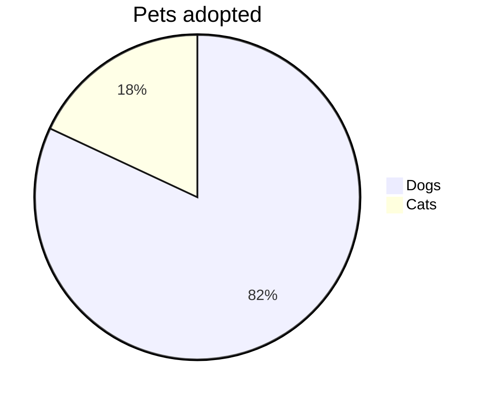

# Mermaid fences

```mermaid
flowchart LR
  Client[Browser] --> Api{API up?}
  Api -->|yes| Db[(Orders DB)]
  Api -->|no| Retry[Retry later]
```

```mermaid
sequenceDiagram
  participant Shop
  participant Pay as Payments
  Shop->>Pay: Charge card
  Pay-->>Shop: Receipt
```

```mermaid
pie title Pets adopted
  "Dogs" : 386
  "Cats" : 85
```
